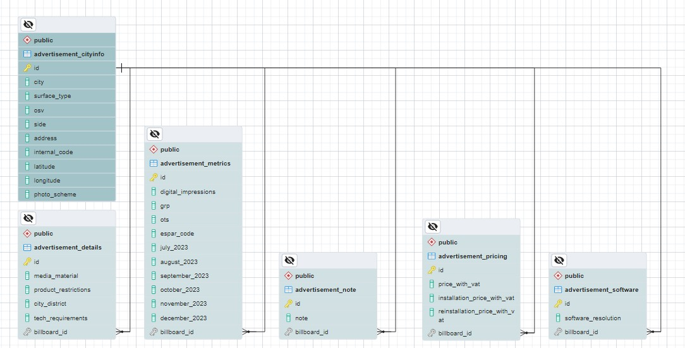
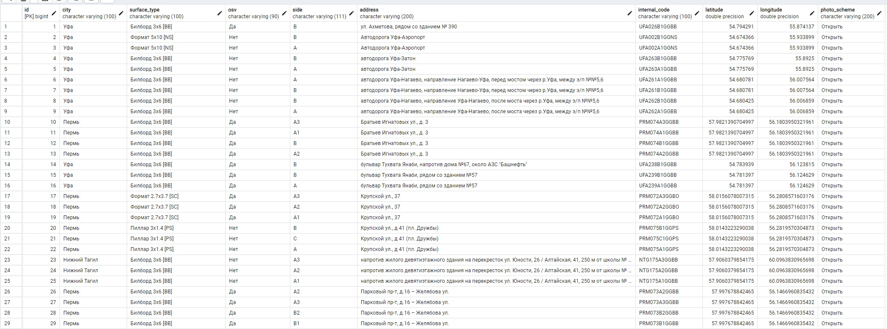

 # “Parsing_orm_postgresql”
 [](https://opensource.org/licenses/MIT)


## Описание
Цель: Написать программу, которая будет парсить файл excel и загружать данные в базу postgresql.

## Требования к реализации
- Загрузка в базу должна осуществляться с помощью Django ORM.
- База данных Postgresql.
- Можно пользоваться любыми библиотеками.

## **Стек:**
 


### **Дополнительные библиотеки:**
[](https://pandas.pydata.org/)
[](https://openpyxl.readthedocs.io/en/stable/)
[](https://pypi.org/project/django-extensions/)
[](https://pypi.org/project/psycopg2-binary/)
[](https://pypi.org/project/python-dotenv/)


## **Схема(структура) базы данных:**


## **Запуск проекта в dev-режиме**
Инструкция ориентирована на операционную систему Windows и утилиту git bash.<br/>
##### Для прочих инструментов используйте аналоги команд для вашего окружения.

1. Клонируйте репозиторий и перейдите в него в командной строке:
```python
git clone https://github.com/artyom-vah/parsing_orm_postgresql.git
```

2. Установите и активируйте виртуальное окружение
```python
python -m venv venv
```

```python
source venv/Scripts/activate
```

_или сразу так:_

```python
python -m venv venv && . venv/Scripts/activate
```

3. Обновите pip 
```python
python -m pip install --upgrade pip
```

4. Установите зависимости из файла requirements.txt
```python
pip install -r requirements.txt
```
5. Если нужно запустить базу данных [sqlite3](sqlite3), то в файле settings.py раскомментируем:
```python
DATABASES = {
    'default': {
        'ENGINE': 'django.db.backends.sqlite3',
        'NAME': BASE_DIR / 'db.sqlite3',
    }
}
```
_и делаем миграции:_
```python
python manage.py makemigrations 
```
```python
python manage.py migrate
```

5.1 Если нужно запустить базу данных postgresql, сначала создаем бд в pgAdmin, далее добавляем файл [.env](.env) в папку [project](project) (там где находится файл [settings.py](project%2Fsettings.py))
 в нем прописываем 
```python
DB_ENGINE=django.db.backends.postgresql_psycopg2
DB_NAME=postgres # testdb например 
DB_USER=postgres
DB_PASSWORD=postgres # 12345678 например 
DB_HOST=localhost
DB_PORT=5432
```
_в DB_NAME прописываем имя базы данных, в DB_PASSWORD прописываем пароль_

6. В файле settings.py прописываем:
```python
DATABASES = {
    'default': {
        'ENGINE': os.getenv('DB_ENGINE', default='django.db.backends.postgresql_psycopg2'),
        'NAME': os.getenv('DB_NAME', default='postgres'),
        'USER': os.getenv('POSTGRES_USER', default='postgres'),
        'PASSWORD': os.getenv('POSTGRES_PASSWORD', default='postgres'),
        'HOST': os.getenv('DB_HOST', default='localhost'),
        'PORT': os.getenv('DB_PORT', default='5432')
    }
}
```

7. В папке с файлом manage.py создайте и выполните миграции:

```python
python manage.py makemigrations 
```
```python
python manage.py migrate
```

**Скрины из базы данных Postgres :**





<br>
**Автор проекта: Артем Вахрушев.**